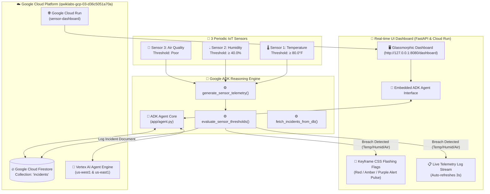

# 3-Sensor IoT Monitoring & Agent Action System

An autonomous AI Agent built with the **Google Agent Development Kit (ADK)** Python SDK, integrated with a **Native Firestore** incident backend, real-time periodic **3-Sensor Telemetry Engine**, and a dynamic **Glassmorphic Web UI Dashboard** with flashing alert flags.

---

## 🏗️ System Architecture Diagram



---

## 🌟 Key Features

* **3 Periodic IoT Telemetry Sensors**:
  * **Sensor 1 (Temperature)**: Generates random Fahrenheit readings ($\ge 80.0^\circ\text{F}$ raises Red Alert Flag).
  * **Sensor 2 (Humidity)**: Generates random relative humidity percentages ($\ge 40.0\%$ raises Amber Alert Flag).
  * **Sensor 3 (Air Quality)**: Evaluates Air Quality status (`Poor` status raises Purple Alert Flag).
* **Automatic Firestore Incident Persistence**: Every threshold breach automatically logs a structured document to the native Firestore `incidents` collection on GCP project `qwiklabs-gcp-03-d36c5051a70a`.
* **Dynamic Visual Web Dashboard**: Real-time CSS `@keyframes` pulse animations, 3-second auto-updating telemetry feed, and embedded ADK Agent Assistant chat interface.
* **Dual Multi-Region Deployment**: Deployed to both **Google Cloud Run** and **Vertex AI Agent Engine** in `us-west1` and `us-east1`.

---

## Project Structure

```
log-analyzer-agent/
├── app/         # Core agent code
│   ├── agent.py               # Main agent logic
│   ├── fast_api_app.py        # FastAPI Backend server
│   └── app_utils/             # App utilities and helpers
├── tests/                     # Unit, integration, and load tests
├── GEMINI.md                  # AI-assisted development guide
└── pyproject.toml             # Project dependencies
```

> 💡 **Tip:** Use [Antigravity CLI](https://antigravity.google/) for AI-assisted development - project context is pre-configured in `GEMINI.md`.

## Requirements

Before you begin, ensure you have:
- **uv**: Python package manager (used for all dependency management in this project) - [Install](https://docs.astral.sh/uv/getting-started/installation/) ([add packages](https://docs.astral.sh/uv/concepts/dependencies/) with `uv add <package>`)
- **agents-cli**: Agents CLI - Install with `uv tool install google-agents-cli`
- **Google Cloud SDK**: For GCP services - [Install](https://cloud.google.com/sdk/docs/install)


## Quick Start

Install `agents-cli` and its skills if not already installed:

```bash
uvx google-agents-cli setup
```

Install required packages:

```bash
agents-cli install
```

Test the agent with a local web server:

```bash
agents-cli playground
```

You can also use features from the [ADK](https://adk.dev/) CLI with `uv run adk`.

## Commands

| Command              | Description                                                                                 |
| -------------------- | ------------------------------------------------------------------------------------------- |
| `agents-cli install` | Install dependencies using uv                                                         |
| `agents-cli playground` | Launch local development environment                                                  |
| `agents-cli lint`    | Run code quality checks                                                               |
| `agents-cli eval`    | Evaluate agent behavior (generate, grade, analyze, and more — see `agents-cli eval --help`) |
| `uv run pytest tests/unit tests/integration` | Run unit and integration tests                                                        |
| `agents-cli deploy`  | Deploy agent to Agent Runtime                                                                |
| `agents-cli publish gemini-enterprise` | Register deployed agent to Gemini Enterprise                    || [A2A Inspector](https://github.com/a2aproject/a2a-inspector) | Launch A2A Protocol Inspector                                                        |

## 🛠️ Project Management

| Command | What It Does |
|---------|--------------|
| `agents-cli scaffold enhance` | Add CI/CD pipelines and Terraform infrastructure |
| `agents-cli infra cicd` | One-command setup of entire CI/CD pipeline + infrastructure |
| `agents-cli scaffold upgrade` | Auto-upgrade to latest version while preserving customizations |

---

## Development

Edit your agent logic in `app/agent.py` and test with `agents-cli playground` - it auto-reloads on save.

## Deployment

```bash
gcloud config set project <your-project-id>
agents-cli deploy
```

To add CI/CD and Terraform, run `agents-cli scaffold enhance`.
To set up your production infrastructure, run `agents-cli infra cicd`.

## Observability

Built-in telemetry exports to Cloud Trace, BigQuery, and Cloud Logging.

## A2A Inspector

This agent supports the [A2A Protocol](https://a2a-protocol.org/). Use the [A2A Inspector](https://github.com/a2aproject/a2a-inspector) to test interoperability.
See the [A2A Inspector docs](https://github.com/a2aproject/a2a-inspector) for details.
